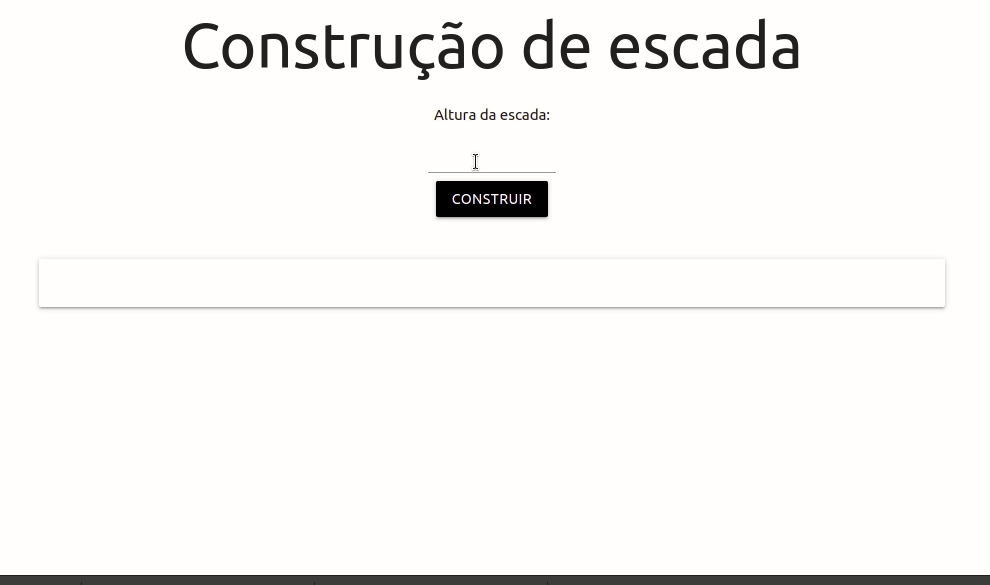

# CONSTRUINDO UMA ESCADA
O usuário entra com a quantidade de degraus desejados e a escada é construída.

:heavy_check_mark: Ferramentas e tecnologias utilizadas

* Intellij IDEA Community
* https://start.spring.io/
* Projeto Maven
* Spring Boot 2.6.3
* Java 8
* Materialize 1.0.0
* JQuery 3.1.1
* CSS 3
* HTML5
 

## :hammer: Funcionalidades do Projeto

- `Funcionalidade`: construir escada

## :arrow_forward: Execução do Projeto

O arquivo  .jar dentro da pasta target deve ser executado com a JVM. 
* java -jar escada-2.0.0-SNAPSHOT.jar  (executar o seguinte arquivo usando a JVM)
* http://localhost:8090/  (abrir o no navegador o seguinte endereço)

